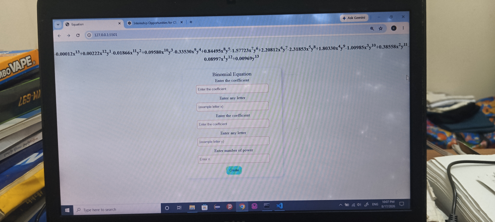

# Binomial Equation Calculator

A simple and interactive web application that expands binomial expressions using JavaScript.

## 📌 About The Project

This project is a JavaScript-based Binomial Equation Calculator.
Users can enter values for the coefficients, variables, and power, and the application generates the expanded binomial equation.

The project was built to practice JavaScript logic, mathematical calculations, DOM manipulation, loops, functions, conditional statements, and dynamic HTML rendering.

## 🚀 Features

- Expand binomial equations
- Support positive and negative coefficients
- Support decimal values
- Generate dynamic mathematical expressions
- Display exponents using HTML `<sup>` elements
- Input validation
- Responsive user interface

## 🛠️ Technologies Used

- HTML5
- CSS3
- JavaScript
- DOM Manipulation

## 🧠 What I Learned

Through this project, I practiced:

- JavaScript functions
- Loops and conditional statements
- Array manipulation
- DOM manipulation
- Event handling
- Mathematical calculations with `Math.pow()`
- Handling decimal values and floating-point precision
- Dynamic HTML generation
- Input validation

binomial-equation-calculator/
│
├── image
│    └── screenshot.jpg
├── js
│   └── script.js
├── style
│   └── style.js
├── index.html
└── README.md

## 📷 Screenshots

### Binomial Equation Calculator



## 💻 How to Run

1. Clone this repository

```bash
git clone https://github.com/Kyaw-Khine-Aung-ucss/binomial-calculation

👨‍💻 Author

Kyaw Khine Aung

Computer Science Student | Junior Web Developer

- GitHub: https://github.com/Kyaw-Khine-Aung-ucss
- Portfolio: https://your-portfolio-link.netlify.app/